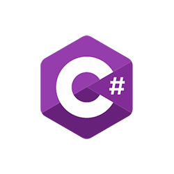

### Repositório com códigos simples C++, C e C#

### 🎨 Sobre
 
Repositório dedicado a códigos em linguagens como C++, C e C#.
No momento não há muitos...

<code></code>
<code></code>
<code></code>

---
feito com ❤️ por [Luan Fernando](https://www.linkedin.com/in/luan-fernando/).
